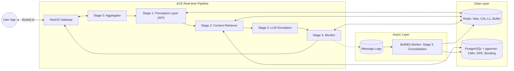

# Kiến trúc Kỹ thuật Chi tiết (Technical Architecture) - AmiSoul

**Phiên bản:** ACE v2.1 (v3.0.0)
**Cập nhật lần cuối:** 2026-04-30

Tài liệu này chi tiết hóa cách triển khai các thành phần logic của ACE v2.1 (Stage 0-5) lên hạ tầng kỹ thuật đã chọn (Node.js/NestJS).

---

## 1. Sơ đồ Thành phần Hệ thống (System Component Diagram)

Sơ đồ này mô tả cách các dịch vụ tương tác với nhau:

---

## 2. Luồng Xử lý Tin nhắn (Message Flow Sequence)

### 2.1. Stage 0: Buffer & Debounce
- Khi tin nhắn đến via Socket.io:
    1. Kiểm tra Redis key `debounce:{user_id}`.
    2. Nếu chưa có: Tạo key, set TTL 1.5s, khởi chạy một Timer/Timeout trong Node.js.
    3. Nếu đã có: Append tin nhắn vào list `buffer:{user_id}` trong Redis, reset Timer (nếu chưa quá Hard Cap 4s).
    4. **Async Interrupt (Preemption):** Nếu nhận tin nhắn mới khi Pipeline (Stage 1-3) đang chạy, API Gateway phát tín hiệu hủy (AbortSignal) để dừng stream hiện tại, gom tin mới và khởi động lại Pipeline.
    5. Khi Timer hết hạn: Gom toàn bộ tin nhắn, xóa key, đẩy vào Stage 1.

### 2.2. Stage 1 & 2: Nhận thức & Truy xuất
- **Stage 1 (Router):** 
    - Gọi Gemini Flash API để lấy JSON: `{intent, sentiment, complexity, urgency, identity_anomaly}`.
    - **Summarization:** Nếu Message Block > 800 tokens, yêu cầu Gemini tóm tắt ngay trong cùng 1 lần gọi (Multi-task Prompt).
    - **Identity Check:** So sánh style nhắn tin với `Behavioral_Signature` trong Redis để phát hiện `Identity_Anomaly`.
- **Stage 2 (Parallel):**
    - **CAL Check:** Đọc Redis (L1) bằng `ioredis`.
    - **CMA Retrieval:** Thực hiện query vector bằng `Prisma` (`$queryRaw`) trên PostgreSQL.
- **Merge Context:** Tổng hợp thành Prompt theo đúng tỷ lệ Budget (3000 tokens).

### 2.3. Stage 3 & 4: Giả lập & Giám sát
- **Stage 3:** Stream phản hồi từ Gemini SDK về API Gateway để User thấy "đang trả lời".
- **Stage 4:** 
    - Kiểm tra Safety (Heuristic/Regex) và cập nhật `Session_Vibe` vào Redis.
    - **CAL Fast-track Sync:** Thực hiện trích xuất nhanh các kỳ vọng (Expectations) hoặc trạng thái dở dang (Pending States) từ phản hồi vừa sinh và ghi trực tiếp vào Redis L1 (TTL 24h) để tạo nhận thức tức thời cho các tin nhắn sau trong cùng phiên.

---

## 3. Quản lý Trạng thái (State Management Strategy)

| Loại dữ liệu | Cơ chế đồng bộ (Sync) | Chiến lược Cache |
|---|---|---|
| **Session Vibe** | Write-through to Redis. | Chỉ tồn tại trong Redis, xóa sau 30p inactivity. |
| **Bonding Score** | Read via Prisma on session start -> Cache in Redis. | BullMQ Worker tính toán lại và ghi đè DB. |
| **CAL (Expectations)**| Write to Redis (L1) via Stage 4/5. | BullMQ dọn dẹp và lưu trữ bền vững (L2). |
| **CMA (Memories)** | Write to DB via BullMQ. | Dùng Indexing (HNSW) trong pgvector. |

---

## 4. Giai đoạn 5: Củng cố Offline (Consolidation Worker)

Tiến trình này được xử lý bởi **BullMQ Workers** chạy tách biệt với Main Thread:

1. **Memory Compression:** 
    - Lấy toàn bộ Log của session từ Redis/DB.
    - Dùng LLM (Gemini Flash) tóm tắt thành Episodic Nodes.
    - Tạo Vector Embedding và lưu vào pgvector.
2. **Persona & Bonding Update:**
    - Tính toán `Bonding_Delta` dựa trên Sentiment/Frequency của session.
    - Cập nhật DPE (Dynamic Persona Evaluation).
3. **CAL Sync:** 
    - Chuyển các Pending States dở dang sang DB L2.
    - Dọn dẹp RAM Redis.

---

## 5. Xử lý Lỗi & Khả năng Chịu lỗi (Resilience)

- **Circuit Breaker:** Sử dụng `nestjs-circuit-breaker` cho các cuộc gọi API LLM.
- **Graceful Shutdown:** NestJS hooks (`onModuleDestroy`) đảm bảo Buffer được flush trước khi tắt.
- **Retry Logic:** BullMQ có sẵn cơ chế retry với cấu hình `attempts` và `backoff`.

---

## 6. Bảo mật & Mã hóa Dữ liệu (Data Security)

Để đảm bảo an toàn cho các tâm sự nhạy cảm của người dùng:
- **AES-256-GCM:** Mã hóa dữ liệu Episodic Memory (CMA) trước khi lưu vào PostgreSQL.
- **Bcrypt:** Băm mật khẩu và các thông tin định danh nhạy cảm.
- **TLS 1.3:** Bắt buộc cho toàn bộ kết nối giữa App và Gateway.
- **Data Anonymization:** Tự động loại bỏ thông tin PII (Personally Identifiable Information) trước khi đưa vào Stage 5 nén ký ức.

---

## 7. Tài liệu Tham chiếu
- **[Đặc tả Yêu cầu (SRS)](./SRS.md)**
- **[Lựa chọn Công nghệ (Tech Stack)](./TechStack.md)**
- **[Thiết kế Hệ thống Hợp nhất (ACE Core Design)](./ACE_Core_Design.md)**
