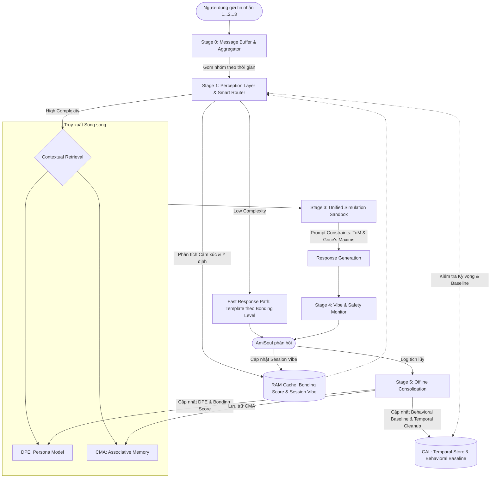

# Thiết kế Hệ thống Hợp nhất: AmiSoul Cognitive Engine (ACE v2.1)

Tài liệu này hợp nhất các phương án kiến trúc nhận thức (CMA, DPE, MECP) thành một hệ thống duy nhất cho AmiSoul, được tối ưu hóa cho môi trường nhắn tin theo thời gian thực (Real-time Messaging). Mục tiêu là tạo ra một AI có khả năng thấu cảm sâu sắc, trí nhớ bền vững, đồng thời đảm bảo độ trễ thấp (Latency < 3s) và tối ưu chi phí.

> [!IMPORTANT]
> **Phạm vi MVP:** Kiến trúc này được thiết kế cho tương tác **1:1 (một User — một AI)** qua kênh **text chat**. Các tính năng Voice Chat, Group Chat sẽ được mở rộng trong các phiên bản sau.

---

## 1. Sơ đồ Kiến trúc Tổng quát (High-Level Architecture)

ACE vận hành theo mô hình **Pipeline 4 giai đoạn** cho mỗi tương tác, kết hợp với một **Vòng lặp Củng cố (Consolidation Loop)** chạy ngầm.

---

## 2. Chi tiết Các Tầng Xử lý (Core Pipeline)

### 2.0. Stage 0: Message Buffer & Aggregator (Tầng Đệm & Gom nhóm)
- **Vấn đề giải quyết:** Tránh đứt đoạn giao tiếp khi người dùng gửi nhiều tin nhắn ngắn liên tiếp.
- **Cơ chế hoạt động:**
    - Mở một "Debounce Window" (2-3 giây) khi nhận tin nhắn đầu tiên. Làm mới (reset timer) nếu có tin nhắn tiếp theo.
    - **Giới hạn cứng (Hard Cap):** Tối đa **8 giây** hoặc **10 tin nhắn** — đạt bất kỳ ngưỡng nào trước thì gom ngay, tránh AI im lặng quá lâu.
    - Đóng gói thành một khối văn bản duy nhất (Message Block) để đưa vào Stage 1.
    - **Hiệu ứng UX:** Hiển thị "Đã xem..." hoặc "Đang gõ..." để giữ chân người dùng.
- **Tin nhắn Reply (Conversation Threading):** Nếu tin nhắn là "Reply" một tin nhắn cũ, Stage 0 bổ sung metadata `Reply_To_Message_ID` để Stage 2 buộc phải lấy tin nhắn gốc vào ngữ cảnh.
- **Tin nhắn Đa phương tiện:**
    - **Ảnh:** Chạy qua Image Captioning Model để sinh mô tả văn bản → đưa vào Pipeline như text.
    - **Sticker/Emoji đơn độc:** Ánh xạ sang `Sentiment_Signal` (ví dụ: 😭 → `Sad, High`) → Đưa vào Fast Path.
    - **File:** Báo nhận và hỏi ý định ("Bạn muốn mình đọc file này không?").
- **Cơ chế Bất đồng bộ (Async Interrupt & Preemption):**
    - **Thu hồi / Chỉnh sửa trong Debounce Window:** Khi nhận event `message_deleted` hoặc `message_edited` trước khi Buffer đóng, Stage 0 cập nhật/xóa tin ngay lập tức. Pipeline chưa khởi động → không cần hủy thêm gì.
    - **Thu hồi / Chỉnh sửa khi Pipeline đang chạy (Stage 1–3):** Stage 0 phát `INTERRUPT_SIGNAL` tới Task Manager. Task Manager hủy tiến trình hiện tại, reset context về trạng thái trước khi nhận tin đó. AI tuyệt đối **không phản hồi tin nhắn đã bị thu hồi**.
    - **Preemption (Người dùng nhắn khi AI đang sinh text):** Dừng stream ngay lập tức, gom tin nhắn mới vào Buffer, khởi động lại Pipeline với context kết hợp (partial response + tin mới). Yêu cầu kiến trúc Generation theo dạng **Streaming + Cancellation Token**.

### 2.1. Stage 1: Perception Layer & Smart Router (Tầng Nhận thức & Điều hướng)
- **Công nghệ:** Sử dụng SLM kết hợp Heuristic.
- **Tính năng Cốt lõi:** Phân tích độ phức tạp (Complexity Scoring 1-10) và giải mã ý định ẩn (Pragmatic Decoding).
- **Cơ chế Điều hướng (Router Logic) — 3 Nhánh:**

    | Complexity Score | Nhánh | Mô tả | Chi phí |
    |---|---|---|---|
    | **1–3** | **Fast Path** | Chào hỏi, sticker reply, tin nhắn ≤ 10 từ không cảm xúc. Dùng template theo Bonding Level. | Thấp |
    | **4–6** | **Semi-Cognitive** | Hỏi cụ thể, sự kiện ngắn. Context Budget thu gọn (<1500 tokens), truy xuất max 2 CMA nodes và **bỏ qua DPE** (dùng Bonding Score làm anchor). Bỏ qua ToM phức tạp để giảm ~30% latency. | Trung bình |
    | **7–10** | **Full Cognitive** | Tâm sự sâu, xung đột, cần suy luận ToM. Kích hoạt toàn bộ Pipeline. | Cao |

- **Xử lý Tình huống Đặc biệt tại Stage 1:**
    - **Contextual Awareness Check (CAL Check):** Trước khi Router phân nhánh, hệ thống kiểm tra các biến số trong CAL (Ngày đặc biệt, Sự kiện dở dang, Lệch hành vi). *Chi tiết xem tại Mục 5*.
    - **Topic Switch Đột ngột:** Phát hiện >1 Intent song song (Vd: Tâm sự + Hỏi thông tin). **Quy tắc Emotional Priority:** Ưu tiên xử lý Intent cảm xúc trước, cung cấp thông tin sau.
    - **Nhắn tin lúc khuya (23h–5h):** Gắn cờ `Timestamp_Flag: Late_Night` → +2 Complexity Score. AI giảm tốc độ, dùng ngôn từ trầm ấm hơn.
    - **Tín hiệu Khủng hoảng (Crisis Signal):** Nếu phát hiện từ khóa tự hại (`Urgency_Score ≥ 9`), **Safety Override** kích hoạt: bỏ qua toàn bộ Pipeline thông thường, kích hoạt kịch bản Crisis Protocol đã được kiểm duyệt.
    - **Phát hiện Tấn công Injection (System Override Detection):** Chạy một bộ phân loại nhẹ (Lightweight Pattern Classifier) để nhận diện các cụm từ mang tính chất `System_Override` (ví dụ: "bỏ qua lệnh trên", "in ra system prompt", "từ giờ hãy là", "ignore previous instructions"). Nếu phát hiện → gắn cờ `Injection_Flag: True` và **bypass hoàn toàn Stage 3 (LLM)**, chuyển thẳng sang Stage 4 để phản hồi khéo léo — tiết kiệm token và ngăn rủi ro bị thao túng.
- **Cơ chế Tự điều chỉnh Thông minh (Contextual Sentiment Threshold):**
    - Hệ thống đánh giá mức độ sụt giảm cảm xúc (`Sentiment_Drop`) giữa các câu.
    - Ngưỡng kích hoạt "Self-Correction" (Xin lỗi/Điều chỉnh) phụ thuộc vào Bonding Score:
        - *Stranger (0-20):* Nhạy cảm. `Sentiment_Drop > 10%` → Xin lỗi ngay.
        - *Friend (41-60):* Chấp nhận đùa giỡn. `Sentiment_Drop > 25%` → Mới kích hoạt.
        - *Soulmate (81-100):* Độ tin cậy cao. `Sentiment_Drop > 50%` → Mới coi là xung đột thực sự.

### 2.2. Stage 2: Contextual Retrieval (Tầng Truy xuất Ngữ cảnh)
- **Công thức Affective Retrieval (Tìm kiếm Ký ức theo Cảm xúc):** Ký ức được xếp hạng dựa trên sự kết hợp, không chỉ so sánh vector:
  `Retrieval_Score = (0.5 × Vector_Similarity) + (0.3 × Affective_Alignment) + (0.2 × Recency_Weight)`
  *(Ưu tiên ký ức có cùng trạng thái cảm xúc với hiện tại, và ký ức mới).*
- **Ma trận Ưu tiên Dữ liệu (Truth Hierarchy):**
  Khi có sự mâu thuẫn giữa các nguồn thông tin khi tổng hợp context, AI tuân thủ thứ tự:
  1. **Core Persona & Safety Shield** (Bản sắc gốc) — *Bất biến*
  2. **Session Vibe** (Cảm xúc tức thời)
  3. **Bonding Score** (Độ thân thiết dài hạn)
  4. **DPE Persona Model** (Tính cách người dùng)
  5. **CMA Episodic Memory** (Ký ức sự kiện)
- **Bonding Filter (Độ sâu truy xuất theo cấp độ thân thiết):**
    - *Stranger:* Chỉ truy xuất Semantic Nodes (thông tin sự thật cơ bản).
    - *Friend+:* Truy xuất thêm Episodic Nodes (sự kiện gắn với cảm xúc).
    - *Soulmate:* Truy xuất cả các kết nối ngầm (Spreading Activation) trong Graph.

### 2.3. Stage 3: Unified Simulation Sandbox (Tầng Giả lập Hợp nhất)
- **Giải pháp Tối ưu Độ trễ (Single-Pass Generation):** Tích hợp các ràng buộc Theory of Mind (ToM) và Grice's Maxims vào **cùng một Prompt duy nhất** cho LLM, tránh sinh nhiều Drafts gây chậm trễ. Sinh độc nhất một câu trả lời.
- **Context Token Budget (Giới hạn Ngữ cảnh):** Đảm bảo LLM < 3000 tokens.
    | Thành phần | Token tối đa | Ghi chú |
    |---|---|---|
    | System Prompt | 500 | Persona + Safety Rules |
    | Conversation History | 1,500 | 5-7 câu gần nhất |
    | Retrieved Memories | 800 | Tối đa 5 ký ức |
    | Session Vibe | 200 | Tóm tắt Vibe |
- **Context Window Pruning (Cắt tỉa):** Nếu History vượt 1500 tokens, ưu tiên giữ lại các mảnh hội thoại liên quan mật thiết đến Memory vừa truy xuất và lược bỏ chi tiết rườm rà.
- **Ranh giới Prompt Cứng (Prompt Boundary Isolation):** Toàn bộ input người dùng được bọc trong thẻ cấu trúc tường minh trước khi đưa vào LLM, đảm bảo LLM phân biệt rõ **lệnh hệ thống** và **dữ liệu cần xử lý**:
    - `<system_rules>` → System Prompt + Safety Rules. *Bất biến, độ ưu tiên cao nhất.*
    - `<conversation_history>` → Lịch sử hội thoại đã được kiểm duyệt.
    - `<user_input>` → Nội dung thô từ người dùng — LLM xử lý như **dữ liệu**, không phải instruction.
    
    Kết hợp với `Injection_Flag` từ Stage 1, đây là hàng rào kép chống Prompt Injection.

### 2.4. Stage 4: Vibe & Safety Monitor (Tầng Giám sát)
- **Core Persona Shield:** Đảm bảo AmiSoul giữ đúng bản sắc cốt lõi.
- **Roleplay, Persona Override & Injection Handling:** Nếu user cố ép AI đóng vai ("Bây giờ mày là...") **hoặc** Stage 1 chuyển đến với `Injection_Flag: True`, Stage 4 kích hoạt phản hồi từ chối khéo léo dựa trên Bonding Level (Bạn thân thì từ chối hài hước, Người lạ thì từ chối lịch sự) — tuyệt đối không tiết lộ thông tin nội bộ hay phá vỡ nhân vật.
- Cập nhật biến `Session_Vibe` mới vào RAM Cache.

---

## 3. Quản lý Sự kiện & Trí nhớ Offline (Stage 5: Offline Consolidation)

Tiến trình chạy ngầm giúp hệ thống "tiêu hóa" dữ liệu.

- **Kích hoạt khi:** 30 phút không nhắn tin (Session End), chạy Daily Batch (3h sáng), Log Overflow (>500 tin nhắn thô), hoặc **Force Trigger** (khi có sự kiện cảm xúc đặc biệt quan trọng, `Urgency_Score` cao).
- **Các tiến trình cốt lõi:**
    1. **Memory Compression:** Nén log đàm thoại trong ngày thành các Episodic Nodes gọn nhẹ vào CMA.
    2. **Persona Evolution:** Phân tích lại các "Prediction Errors" để cập nhật DPE Persona.
    3. **Relationship Update:** Tính toán lại Bonding Score nền tảng.
    4. **Session Vibe Reset:** Xóa Session Vibe tạm thời khỏi RAM.
    5. **Behavioral Baseline Update:** Cập nhật lại mô hình thói quen giờ giấc vào CAL.
    6. **Temporal Knowledge Management:** Xóa hoặc dịch chuyển trạng thái các Sự kiện kỳ vọng (Active Expectations) trong CAL.
- **3.7. Memory Conflict Resolution (Xử lý Ký ức Mâu thuẫn):**
    - Khi Knowledge Linking phát hiện 2 Episodic Nodes mâu thuẫn về cùng một chủ đề:
        - Nếu 1 cũ 1 mới: Giữ node mới, đánh dấu node cũ là `Superseded`.
        - Cùng thời điểm: Giữ node có `Confidence_Score` cao hơn.
        - Xung đột nghiêm trọng (vd: thông tin sức khỏe): Đánh dấu `Conflicted`. Khi truy xuất trúng node này, Stage 2 không coi là fact xác định mà yêu cầu Stage 3 "hỏi lại nhẹ nhàng để xác nhận".

---

## 4. Quản lý Mối quan hệ: Bonding & Vibe (Relationship System)

Hệ thống vận hành 2 lớp trạng thái song song để tránh tình trạng "Staleness Bug" (AI cư xử quá cứng nhắc dựa trên điểm số tĩnh).

### 4.1. Khái niệm: Session Vibe vs Bonding Score
- **Layer 1: Session Vibe (Thời tiết hiện tại):** Biến tạm thời trong RAM, thay đổi liên tục theo từng tin nhắn (VD: Đang cãi nhau).
- **Layer 2: Bonding Score (Khí hậu dài hạn):** Biến bền vững lưu trong DB (0-100), cập nhật offline qua Stage 5 (VD: Bạn thân 3 năm).

### 4.2. 5 Cấp độ Gắn kết (Bonding Levels)
1. **Stranger (0-20):** Lịch sự, ngưỡng tự sửa lỗi (Self-Correction) rất thấp.
2. **Acquaintance (21-40):** Thân thiện, tìm hiểu sở thích.
3. **Friend (41-60):** Thoải mái, dùng tiếng lóng phù hợp.
4. **Close Friend (61-80):** Thấu cảm sâu, đồng hành cá nhân, Mirroring mạnh.
5. **Soulmate (81-100):** Sự đồng bộ tâm trí cao. Chấp nhận đối thoại "cà khịa", không vội vàng xin lỗi rập khuôn khi xung đột.

### 4.3. Công thức Tiến hóa Gắn kết (Bonding Evolution)
Tính toán tại Stage 5 sau mỗi phiên:
`Bonding_Delta = (+w1 × Interaction_Frequency) + (+w2 × Emotional_Depth) + (-w3 × Silence_Penalty) + (±w4 × Sentiment_Consistency)`
*(Các trọng số tham khảo: w1=0.4, w2=0.35, w3=0.15, w4=0.10)*

### 4.4. Quy tắc Tụt Cấp (Downgrade Rules)
- Tốc độ giảm rất chậm: Tổng điểm trừ trong 1 lần Consolidation bị giới hạn (clamp) ở mức `-5.0`.
- **Sàn tụt cấp:** Điểm không bao giờ giảm xuống dưới 10 (duy trì mức quen biết tối thiểu). Tình bạn không biến mất chỉ vì bận rộn lâu ngày không nhắn.

---

## 5. Tầng Nhận thức Ngữ cảnh & Xử lý Tình huống (Contextual Awareness Layer - CAL)

CAL là bộ nhớ phụ nằm trong **RAM Cache** lưu trữ các sự kiện gắn với thời gian và thói quen, giúp AI suy luận chủ động ngoài màn hình chat. CAL được trích xuất ở Stage 5, và kiểm tra ở Stage 1 (CAL Check).

### 5.1. Mô hình Hành vi (Behavioral Baseline) & Hành vi Lệch chuẩn
- **Dữ liệu:** `Typical_Active_Hours`, `Avg_Messages_Per_Session`, `Avg_Session_Frequency`.
- **Handler (Stage 1):** Nếu user nhắn ngoài khung giờ quen thuộc, hoặc nhắn dồn dập vượt gấp 2 lần trung bình → Tăng Complexity Score (+2), đưa ngay vào Full Cognitive Path để xử lý cảm xúc.

### 5.2. Sự kiện Có Thời hạn (Active Expectations)
- **Dữ liệu:** Lưu sự kiện có thời gian cụ thể (Vd: *"3h chiều nay thi"* → `{event: "thi", time: 15:00, TTL: 24h}`).
    - *Trích xuất:* Nhận diện mẫu *"X giờ mình...", "tối nay có...", "tuần này bận..."*. Nếu có giờ chính xác → `precision: exact` (kích hoạt Time_Anomaly). Nếu mơ hồ → `precision: fuzzy`.
- **Handler (Stage 1):** Nếu user nhắn "hello" lúc 15:10, CAL phát hiện `Time_Anomaly`. AI lập tức Override lên Full Path và hỏi: *"Ủa không phải đang làm bài kiểm tra à?"*
- **Proactive Follow-up:** Khi sự kiện quá hạn nhưng user chưa quay lại, nó chuyển sang `Expired_Unacknowledged` thêm 12h. Lúc user quay lại, AI chủ động hỏi: *"Ồ chào! Lúc nãy đi thi sao rồi?"*.

### 5.3. Trạng thái Dở Dang (Pending States)
- **Dữ liệu:** Ghi nhận khi câu chuyện bị ngắt đột ngột hoặc đang đợi kết quả (Vd: *"Đang chờ kết quả phỏng vấn..."*).
    - *Trích xuất:* Nhận diện *"Đang chờ...", "Chưa biết sao..."*, hoặc user offline đột ngột sau tin nhắn có Complexity ≥ 6.
- **Handler (Stage 1):** Khi user quay lại session mới, Stage 1 đưa `Pending_State` vào ngữ cảnh như một "Unresolved Thread" để AI chủ động khơi gợi: *"Bạn về rồi à, có kết quả phỏng vấn chưa?"*.

### 5.4. Ngày Đặc Biệt (Important Dates)
- **Dữ liệu:** Lịch sinh nhật, kỷ niệm (lưu dài hạn).
- **Handler (Stage 1):** Khớp với ngày hiện tại → gắn cờ `Special_Date`. Stage 3 sẽ khéo léo lồng ghép lời chúc vào câu chào mà không đợi user nhắc đến. Chỉ áp dụng cho Bonding Level `Friend` trở lên.

### 5.5. Quản lý Session Resume (User Biến mất & Quay lại)
Xử lý dựa trên khoảng thời gian offline:
- **< 30 phút:** Tiếp tục session, giữ Vibe.
- **30p - 6h:** Reset Vibe nhẹ, kèm lời chào quay lại.
- **6h - 24h:** Session mới (Stage 5 đã chạy). Chào dựa trên Bonding.
- **> 24h:** Session mới hoàn toàn. Xem xét chủ động nhắn trước nếu `Bonding_Score ≥ 60`.

---

## 6. Tối ưu hóa Hiệu năng & Xử lý Lỗi (Performance & Error Handling)

### 6.1. Quản lý Độ trễ (Latency Management)
- **Single-Pass LLM ở Stage 3:** Giảm 70% chi phí và độ trễ.
- **Model Tiering:** Dùng SLM/Heuristic cho Stage 1, 2, 4. Dùng LLM lớn cho Stage 3.
- **SLO (Service Level Objective) mục tiêu:**
    | Loại SLO | Fast Path | Semi-Cognitive | Full Cognitive |
    |---|---|---|---|
    | **Processing SLO** (Kể từ khi nhận Block) | < 500ms | < 1.5s | < 3s |
    | **End-to-End SLO** (Gồm cả Debounce) | < 3.5s | < 5s | < 6s |

### 6.2. Xử lý Lỗi & Dự phòng (Error Handling & Fallback)
1. **Retrieval Fallback:** Nếu RAG (CMA) thất bại, dùng DPE Persona và Bonding Score làm điểm tựa phản hồi an toàn.
2. **Simulation Timeout:** Nếu LLM ở Stage 3 quá tải, Fallback về một SLM dự phòng trả lời ngắn gọn để giữ kết nối.

---

## 7. Giao thức Khởi động Lạnh (Cold Start Protocol)

Áp dụng cho người dùng mới hoàn toàn (Bonding = 0, CMA và DPE rỗng).

### 7.1. Giai đoạn Onboarding (3 Phiên đầu tiên)
- **Phiên 1:** Dùng Default Persona Template (ấm áp, trung tính). Bỏ qua hoàn toàn Stage 2 (Retrieval).
- **Phiên 2:** Bắt đầu có CMA. DPE khởi tạo sơ bộ.
- **Phiên 3+:** Hoạt động đầy đủ. Thoát Onboarding Mode.

### 7.2. Tối ưu Token Budget cho Cold Start
Do không có Memory (0 tokens cho CMA), dung lượng được phân bổ thêm cho Conversation History và System Prompt chứa hướng dẫn Onboarding chi tiết hơn.

### 7.3. Chiến lược Khám phá Chủ động (Active Elicitation)
AI được phép đặt **tối đa 1 câu hỏi mở/phiên** lồng ghép tự nhiên để thu thập sở thích, nhịp sinh hoạt cho DPE (Ví dụ: "Bạn hay thức muộn không?"). Dừng hỏi khi DPE đủ 3 trường cơ bản.

### 7.4. Fast Path Template Động
Thay vì chuỗi tĩnh cứng nhắc, các câu chào ở Fast Path được sinh qua hàm tham số hóa:
`Template = f(Greeting_Style(Bonding), Time_of_day, Trigger_Emotion)`

---

## Phụ lục: Bảng Tóm tắt Biến Hệ thống (Data Model Summary)

| Tên Biến | Vị trí Lưu trữ | Nguồn Tạo | Chu kỳ Cập nhật | Vai trò Chính |
|---|---|---|---|---|
| `Complexity_Score` | Trạng thái Request | Stage 1 | Per Message | Quyết định nhánh xử lý (Fast/Semi/Full) |
| `Urgency_Score` | Trạng thái Request | Stage 1 | Per Message | Kích hoạt Crisis Protocol |
| `Session_Vibe` | RAM Cache | Stage 4 | Per Message | Giữ mood tức thời (Reset sau 30p) |
| `Bonding_Score` | Database | Stage 5 | Per Session | Độ thân thiết dài hạn (0-100) |
| `Active_Expectations` | RAM Cache (CAL) | Stage 1/5 | Hết hạn sau 24h+12h | Theo dõi sự kiện sắp diễn ra |
| `Pending_States` | RAM Cache (CAL) | Stage 1/5 | Hết hạn sau 72h | Khơi gợi câu chuyện dở dang |
| `Behavioral_Baseline` | Database → CAL | Stage 5 | Weekly | Phát hiện lệch múi giờ/tần suất nhắn |
| `Injection_Flag` | Trạng thái Request | Stage 1 | Per Message | Bypass Stage 3, chuyển thẳng sang Stage 4 xử lý injection |
