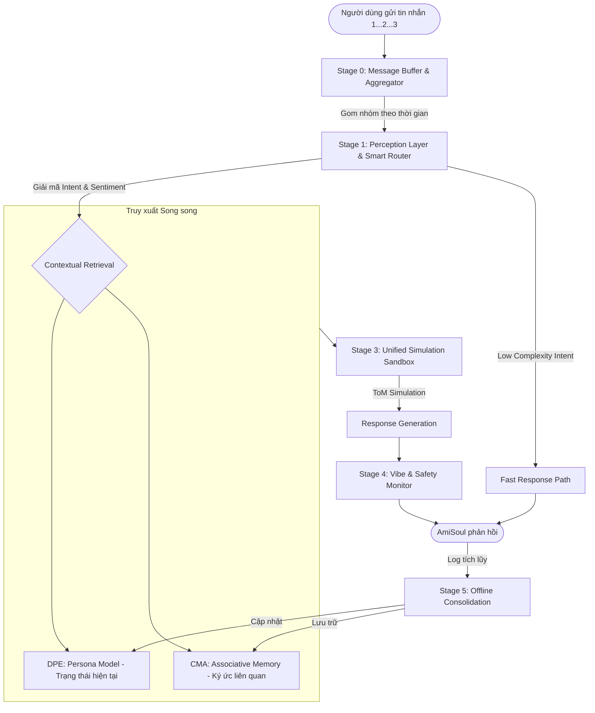

# Thiết kế Hệ thống Hợp nhất: AmiSoul Cognitive Engine (ACE)

Tài liệu này hợp nhất 3 phương án (CMA, DPE, MECP) thành một kiến trúc nhận thức duy nhất cho AmiSoul. Mục tiêu là tạo ra một AI có khả năng thấu cảm sâu sắc, trí nhớ bền vững nhưng vẫn đảm bảo hiệu năng vận hành thực tế.

---

## 1. Sơ đồ Kiến trúc Tổng quát (High-Level Architecture)

ACE vận hành theo mô hình **Pipeline 4 giai đoạn** cho mỗi tương tác, kết hợp với một **Vòng lặp Củng cố (Consolidation Loop)** chạy ngầm.

---

## 2. Chi tiết các Tầng xử lý

### 2.0. Stage 0: Message Buffer & Aggregator (Tầng Đệm & Gom nhóm tin nhắn)
- **Vấn đề giải quyết:** Người dùng thường có thói quen gửi nhiều tin nhắn ngắn liên tiếp (Ví dụ: "Nay chán quá" -> [Gửi] -> "Chắc nghỉ việc" -> [Gửi]). Nếu AI phản hồi ngay lập tức sau tin nhắn đầu tiên, luồng giao tiếp sẽ bị đứt đoạn và hệ thống bị quá tải.
- **Cơ chế hoạt động:**
    - **Debounce Window:** Khi nhận được tin nhắn đầu tiên, hệ thống không xử lý ngay mà mở một "cửa sổ chờ" (ví dụ: 2-3 giây).
    - Nếu trong khoảng thời gian chờ, có thêm tin nhắn mới tới, cửa sổ này sẽ được làm mới (reset timer).
    - Chỉ khi người dùng ngừng nhắn (ngừng gõ) quá thời gian chờ, hệ thống mới gom toàn bộ các tin nhắn lại thành một khối văn bản duy nhất (Message Block) để đưa vào Stage 1.
    - **Hiệu ứng UX:** Trong lúc chờ, UI có thể hiển thị trạng thái "Đã xem..." hoặc AI bắt đầu hiển thị trạng thái "Đang gõ..." để giữ chân người dùng.

### 2.1. Stage 1: Perception Layer & Smart Router (Tầng Nhận thức & Điều hướng)
- **Công nghệ:** Sử dụng SLM kết hợp với bộ lọc Heuristic (Regex).
- **Cơ chế Điều hướng (Router Logic):** Đây là "ngã ba đường" quyết định tốc độ và chất lượng dựa trên *Message Block* vừa được gom.
    - **Nhánh 1: Fast Path (Shallow Processing)**
        - *Điều kiện:* Khối tin nhắn ngắn (< 10 từ), không có từ khóa cảm xúc, là các mẫu giao tiếp phổ biến (Chào, hỏi giờ, xác nhận "OK", "Cảm ơn").
        - *Xử lý:* SLM tạo phản hồi ngay lập tức hoặc dùng Template.
    - **Nhánh 2: Cognitive Path (Deep Processing)**
        - *Điều kiện:* Chứa từ khóa cảm xúc, có cấu trúc câu phức, chứa thực thể (tên riêng), hoặc có dấu hiệu hàm ngôn (Implicature).
        - *Xử lý:* Kích hoạt toàn bộ Pipeline (Retrieval + Simulation).
- **Nhiệm vụ chi tiết:** 
    - **Complexity Scoring:** Gán điểm 1-10 cho độ phức tạp của khối tin nhắn. Nếu < 3 -> Fast Path.
    - **Pragmatic Decoding:** Hiểu ý định ẩn của toàn bộ ngữ cảnh.
    - **Urgency Check:** Phát hiện khẩn cấp.

### 2.2. Stage 2: Contextual Retrieval (Tầng Truy xuất Ngữ cảnh)
- **Cơ chế Persona-First Filter:** Dữ liệu từ **Persona Model (DPE)** sẽ làm mỏ neo.
- **Logic:** Hệ thống sẽ tìm kiếm trong **Associative Memory (CMA)** những ký ức liên quan đến chủ đề hiện tại, nhưng chỉ chọn lọc những gì "khớp" với trạng thái tâm lý hiện tại của người dùng.
- **Kết quả:** Một gói dữ liệu (Context Package) bao gồm: Ý định của User + Persona hiện tại + 3-5 mảnh ký ức liên quan nhất.

### 2.3. Stage 3: Unified Simulation Sandbox (Tầng Giả lập Hợp nhất)
- **Nhiệm vụ:** Đây là nơi thực hiện **Theory of Mind (ToM)**.
- **Quy trình:**
    1. Tạo 2 phương án phản hồi nháp (Drafts).
    2. Chạy giả lập: "Dựa trên Persona của User, họ sẽ phản ứng thế nào với Draft 1 vs Draft 2?".
    3. Chọn phương án có điểm số "Thấu cảm" và "Phù hợp" cao nhất.

### 2.4. Stage 4: Vibe & Safety Monitor (Tầng Giám sát)
- **Persona Anchor:** Đảm bảo AmiSoul giữ đúng bản sắc (Ấm áp, tích cực) ngay cả khi đang Mirroring (bắt chước) phong cách của User.
- **Safety Guardrail:** Lọc bỏ các nội dung nhạy cảm hoặc không phù hợp với tiêu chuẩn cộng đồng.

---

## 3. Cơ chế Củng cố Offline (Stage 5: Offline Consolidation)

Thay vì cố gắng học mọi thứ ngay lập tức, ACE thực hiện việc "tiêu hóa" kiến thức vào cuối ngày (hoặc khi Idle):

1.  **Memory Compression:** Nén các log đối thoại dài thành các **Episodic Nodes** (Sự kiện) ngắn gọn.
2.  **Persona Evolution:** Phân tích các **Prediction Errors** tích lũy trong ngày. Nếu User liên tục thay đổi thói quen, hệ thống mới cập nhật Trọng số Persona (Weighted Algebra).
3.  **Knowledge Linking:** Tạo các liên kết mới giữa các Node thông tin (ví dụ: phát hiện ra một người bạn mới mà User hay nhắc tới).

---

## 4. Tối ưu hóa Hiệu năng (Latency Management)

Để đảm bảo AI phản hồi dưới 3 giây:
- **Caching:** Lưu trữ Persona Model trong RAM/Cache vì dữ liệu này được dùng thường xuyên.
- **Parallelization:** Các bước Stage 1 và Stage 2 được chạy song song.
- **Model Tiering:**
    - Stage 1, 2, 4: Dùng SLM (nhanh, rẻ).
    - Stage 3: Dùng LLM chất lượng cao (thông minh, sâu sắc).
- **Fast Response Path (Short-circuit):** 
    - Đối với các câu lệnh đơn giản (Chào hỏi, cảm ơn, hỏi giờ), hệ thống bỏ qua Stage 2 và 3 để phản hồi ngay lập tức bằng SLM.

---

## 5. Xử lý Lỗi & Dự phòng (Error Handling & Fallback)

Để hệ thống không bao giờ bị "đơ" hoặc trả lời sai lệch nghiêm trọng:
1.  **Retrieval Fallback:** Nếu không tìm thấy ký ức liên quan, hệ thống sẽ sử dụng **DPE Persona** làm dữ liệu duy nhất để tạo phản hồi mang tính lắng nghe chung.
2.  **Safety Override:** Nếu Stage 1 phát hiện `Urgency_Score` cao, hệ thống bỏ qua toàn bộ các bước để kích hoạt `Safety_Protocol` (Số điện thoại hỗ trợ, lời khuyên chuyên gia).
3.  **Simulation Timeout:** Nếu bước Sandbox quá lâu (> 2s), hệ thống tự động chọn Draft 1 và gửi đi để đảm bảo trải nghiệm người dùng.

---

## 6. Quản lý Ngữ cảnh (Context Window Management)

Chiến lược "Pruning" (Cắt tỉa) để tối ưu hóa cửa sổ ngữ cảnh:
- **Ưu tiên 1:** 3-5 câu hội thoại gần nhất (Freshness).
- **Ưu tiên 2:** Các mảnh ký ức liên quan vừa truy xuất (Relevance).
- **Ưu tiên 3:** Tóm tắt ngắn gọn về "Vibe" hiện tại của User (Persona).
- **Loại bỏ:** Các chi tiết rườm rà, các câu chào hỏi xã giao đã cũ.

---

## 5. Ma trận Ưu tiên Dữ liệu (Truth Hierarchy)

Khi có sự mâu thuẫn giữa các nguồn tin, ACE tuân thủ thứ tự ưu tiên:
1.  **Current Interaction Sentiment** (Cảm xúc hiện tại) - Cao nhất.
2.  **DPE Persona Model** (Xu hướng tính cách chung).
3.  **AmiSoul Core Persona** (Bản sắc gốc của AI) - Luôn được bảo toàn.
4.  **CMA Episodic Memory** (Ký ức sự kiện cũ).

---

> [!IMPORTANT]
> Bản thiết kế này chuyển dịch AmiSoul từ một chatbot phản ứng (Reactive) sang một hệ thống nhận thức chủ động (Proactive Cognitive System). Hệ thống không chỉ trả lời câu hỏi, mà liên tục quản lý "mối quan hệ" với người dùng.
