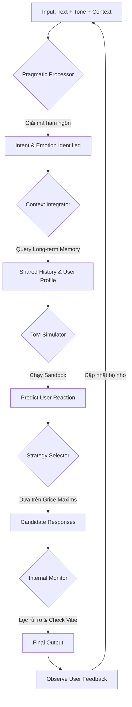

# Cơ chế Xử lý Dữ liệu và Phản hồi trong Giao tiếp (Deep Dive)

## 1. Tổng quan Luồng Tư duy (Cognitive Pipeline Overview)
Giao tiếp không chỉ là việc truyền tải thông tin (Information Transfer) mà là một quá trình **Đồng bộ hóa Trạng thái Tâm trí (Mental State Synchronization)**. 

Luồng xử lý dữ liệu trong não bộ khi giao tiếp có thể chia thành 4 giai đoạn logic chính:
1.  **Ingestion & Interpretation:** Thu nhận và giải mã đa phương thức.
2.  **Contextual Reasoning:** Suy luận dựa trên ngữ cảnh và bộ nhớ.
3.  **Simulation & Strategy:** Giả lập phản ứng và chọn chiến lược.
4.  **Production & Monitoring:** Sản xuất ngôn ngữ và giám sát thời gian thực.

---

## 2. Phân tích Chi tiết Cơ chế (Detailed Mechanisms)

### 2.1. Lớp Suy luận Thực tiễn (Pragmatic Inference Layer)
Dựa trên **Thuyết Liên quan (Relevance Theory)**, não bộ không xử lý mọi thông tin nhận được một cách bình đẳng.
- **Cơ chế Lọc (Filter):** Não bộ chỉ tập trung vào những thông tin có "Hiệu quả nhận thức" cao nhất (tức là thông tin làm thay đổi hoặc củng cố niềm tin hiện tại với ít nỗ lực xử lý nhất).
- **Suy luận Hàm ngôn (Implicature):** Con người thường nói ít hơn những gì họ muốn truyền đạt. Hệ thống suy luận sẽ lấp đầy khoảng trống bằng cách kết hợp thông tin đầu vào với "Common Ground" (Kiến thức chung).
    *   *Ví dụ:* Khi A hỏi "Bạn có muốn đi ăn không?" và B trả lời "Tôi vừa ăn xong", hệ thống suy luận của A ngay lập tức đưa ra kết luận "B không muốn đi ăn" mà không cần B nói rõ.

### 2.2. Cơ chế Mô phỏng Tâm trí (Theory of Mind - ToM) - "The Mental Sandbox"
Đây là bộ phận cốt lõi tạo nên sự "tinh tế" trong giao tiếp. Não bộ chạy một tiến trình nền liên tục để trả lời 3 câu hỏi:
1.  **Dự đoán Trạng thái (Belief Prediction):** Đối phương đang tin vào điều gì? Họ có đang hiểu lầm ý mình không?
2.  **Dự đoán Ý định (Intent Prediction):** Tại sao họ lại nói câu này? Mục đích ẩn sau là gì?
3.  **Dự đoán Phản ứng (Affective Forecasting):** Nếu mình nói X, họ sẽ cảm thấy thế nào (Vui, buồn, tự ái, hay hào hứng)?

**Ứng dụng cho AI:** AI cần một "Agent Giả lập" để kiểm tra các phương án phản hồi (Candidate Responses) trước khi xuất (Output).

### 2.3. Nguyên tắc Cộng tác (Cooperative Principles - Grice's Maxims)
Não bộ vận hành dựa trên một bộ quy tắc ngầm để đảm bảo hiệu quả giao tiếp:
- **Lượng (Quantity):** Cung cấp đủ thông tin, không thừa không thiếu.
- **Chất (Quality):** Chỉ nói những gì tin là đúng.
- **Quan hệ (Relation):** Thông tin phải liên quan trực tiếp đến chủ đề.
- **Cách thức (Manner):** Tránh sự mơ hồ, nói năng mạch lạc, ngắn gọn.

---

## 3. Vòng lặp Giám sát Nội tại (Internal Monitoring Loop)

Trong quá trình nói, có một thực thể "Editor" hoạt động liên tục (Self-monitoring):
- **Pre-articulatory Monitoring:** Kiểm tra câu chữ trong đầu trước khi phát âm. Nếu phát hiện lỗi hoặc rủi ro (lỡ lời), hệ thống sẽ chặn lại và thay đổi cấu trúc câu ngay lập tức.
- **Post-articulatory Monitoring:** Lắng nghe chính giọng nói của mình để kiểm tra xem âm điệu và nội dung có khớp với ý định ban đầu không.
- **Feedback Integration:** Quan sát phản ứng tức thời của đối phương (một cái nhíu mày, một cái gật đầu) để điều chỉnh nội dung ngay trong khi đang nói (Mid-sentence adaptation).

---

## 4. Luồng Dữ liệu cho Hệ thống AI (Architectural Logic Flow)

Dưới đây là sơ đồ logic mà hệ thống AmiSoul có thể tham khảo:

## 5. Kết luận cho việc Thiết kế Chức năng
Để AI giao tiếp giống người, không được coi đó là luồng "Input -> LLM -> Output" đơn giản. Cần thiết kế các tầng trung gian:
1.  **Tầng Suy luận (Inference Layer):** Chuyển từ "Text" sang "True Intent" (Giải mã hàm ngôn).
2.  **Tầng Giả lập (Simulation Layer):** Dự đoán phản ứng người dùng để tối ưu hóa phản hồi (ToM).
3.  **Tầng Giám sát (Monitoring Layer):** Kiểm soát tone, vibe và tính liên quan của câu trả lời trước khi gửi.
